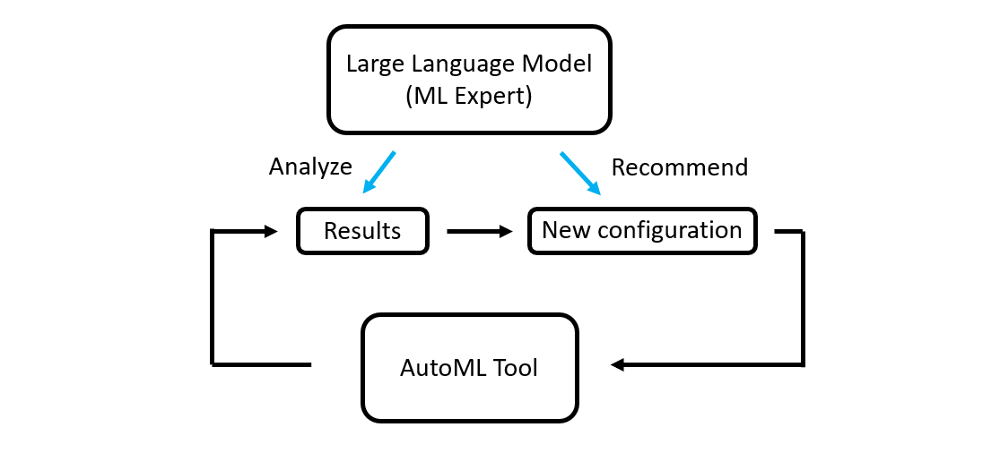

## When AutoML Meets Large Language Model

In this project, we investigated a new paradigm of AutoML: LLM-guided hyperparameter tuning. Here, the key idea is to treat the large language model as an ML expert and leverage its ML domain knowledge to propose a suitable optimization metric, suggest initial search space, as well as recommend refinement for the search space. 

Later, we applied this approach to identify the optimal XGBoost model for a cybersecurity dataset, and our results indicated that the informed hyperparameter search (i.e., the LLM-guided search) yielded a better anomaly detection model than the pure algorithmic-based AutoML tool FLAML, achieving a higher detection rate and a lower false alarm rate.
